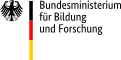

About
=====

The qspec Python package provides mathematical and physical functions
frequently used in laser spectroscopy and other experiments based on laser-atom interactions
as well as more general methods for data processing. 
Most functions are compatible with numpy arrays and are able to process *n*-dimensional arrays.
This enables fast calculations with large samples of data, *e.g.*, facilitating Monte-Carlo simulations.
See the [_installation instructions_](install.html), [_tutorials_](tutorials/tutorials.html)
and the [_API documentation_](doc/doc.html) to get started and explore potential use cases.
A comprehensive summary with highlights and some theoretical background can be found
in the official [_publication_](https://doi.org/10.48550/arXiv.2409.01417).

## Developers and Maintainers

- Patrick M&uuml;ller ([_email_](mailto:pmueller@physics.ucla.edu))

## Testers

- Kristian K&ouml;nig
- Bernhard Maa&szlig;
- Edward Matthews
- Konstantin Mohr
- Laura Renth
- Julien Spahn

## Acknowledgment

Special thanks are due to Prof. Wilfried N&ouml;rtersh&auml;user for providing the financing
and opportunity for the development.
The developers and testers were financially supported in part by the following funding agencies:  

